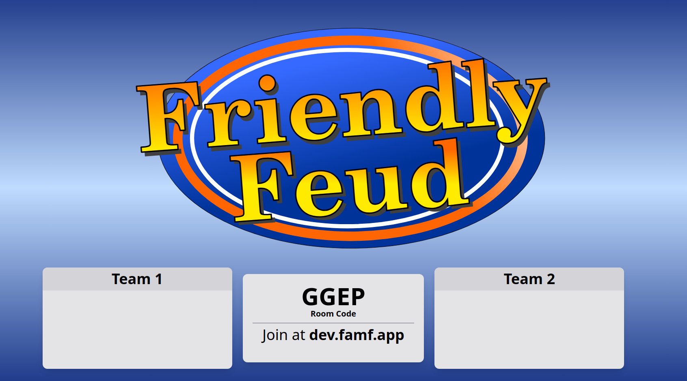
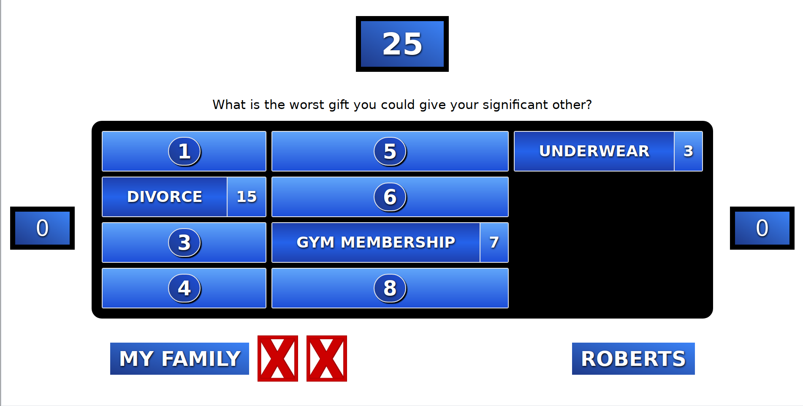
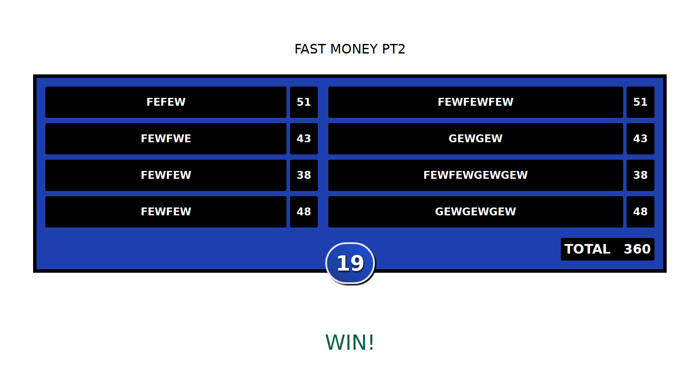

<div align="center">

  
This app is currently available at ➡ https://famf.app

_(it might take a minute to load as it becomes un-suspended from render.com)_

</div>

---

I was unsatisfied with the family feud projects
I found on github and I didn't want to use powerpoint(I use linux 🐧)

I so I decided to make it from scratch and make it as functional as possible.

Features:

- Game creator and loader. Look in `games/` folder for already created games
  load games in either `/new` or `/admin`
- seperated admin console from game window
- Buzzer functionality that accounts for latency with registered players. `/buzzer`
- functional fast money round with appropriate controls
- Changable title screen text
- family feud sounds at triggered events
  (sounds are subject to copyright and will be changed later)
- timers for fast money 1 and 2
- game window screen can go back in history
- Changeable team names
- Hostable/Joinable Rooms with generated room codes
- Localization support
  - English
  - Español
  - Indonesian

## Start

```sh
npm run build
npm run start #( windows, do npm run start_windows )
# npm run dev for working on code
```

go to

https://localhost:3000/

Click on the "Host" button to go to the admin console

Players can join your game by entering in the supplied room code.

if you have trouble do `rm -r node_modules` then retry `npm install`

### Screen Share Audio Linux

it is kinda hard on linux to get an application that will share your audio so here is a quick hack
with pulse audio to pipe your computer's sound through your microphone.

```sh
pactl load-module module-null-sink sink_name=MySink
pactl load-module module-loopback sink=MySink

In pulse audio choose outputs in the recording tab

```

This will give you multiple recording sinks where you can attach one to your microphone and
one your the monitor of your desktop or headset. Resulting in output audio getting piped to your application

## Screenshots







## Contributing

Stack: Nextjs + React + Tail Wind css

### Add A Language

Check out this link in the wiki: [Link](https://github.com/joshzcold/Cold-Family-Feud/wiki/Add-A-New-Language)

### New Games

Go to `/new` to use the new game creator or use "New Game" in the admin console.

Games are loaded in the admin console

If you make a new game make a pull request
and we can add it to the default games in `/games` 😀

Add your game to the language folder you created your game in

For Example Español `games/es/my_spanish_game.json`

For default games I would prefer that they follow a theme.
Like a holiday or topic like tech or media

## Scripts

### Generate Point Values

`scripts/get_points`

Sometimes you have family feud questions and answers, but with no answer point data.

This script does its best to generate an array of points to use giving a number of parameters

```sh
❯ scripts/get_points
"59 38 25 16 11"

❯ scripts/get_points -h
Usage: point_generator -[nmsidv]
 Generate realistic point values for game questions
    -n NUM                           Number of questions to generate points for. Defaults to 5
    -m NUM                           Maxium number to distribute between questions. Defaults to 100
    -a MAX                           Maxium percentage of max points for top answer. Defaults to 60% of max number
    -i MIN                           Minimum percentage of max points for top answer. Defaults to 10% of max number
    -d DESC                          Percentage decrease for each answer after top. Defaults to 66
    -v                               Verbose Mode
```

The script will start with a MAX number then decrease by a percentage to generate numbers.

Works well within a 3-8 point range, but can go higher

```sh
❯ scripts/get_points -n 20 -d 80
"56 44 35 28 22 18 14 11 9 7 6 4 3 3 2 1 1 1 1 0"
```

### Parse CSV Data

Assuming you have family feud data that matches this format

```csv
QUESTION, ANSWER, POINTS, ANSWER, POINTS
```

Or this format

```csv
QUSTION, ANSWER, ANSWER, ANSWER
```

> if you use this format, then this script will auto generate point values
> using the point_generator script/lib above

You can convert lots of CSV files into cold_family_feud .json format

```sh
❯ ./scripts/parse_csv -h
Usage: parse_csv -[rfov] [ CSV_FILES ]
        --no-fast-money              Should fast money rounds be generated
        --ignore-header              ignore the header on csv files
        --no-random                  do not suffle rounds around and go in order of reading files
        --no-multiplier              do not create double point rounds half way through the game
    -r, --rounds=NUM                 How many rounds per a game
    -f, --file-name=NAME             filename format
    -o, --target=FOLDER              where to put generated files
    -v                               Verbose Mode
```
