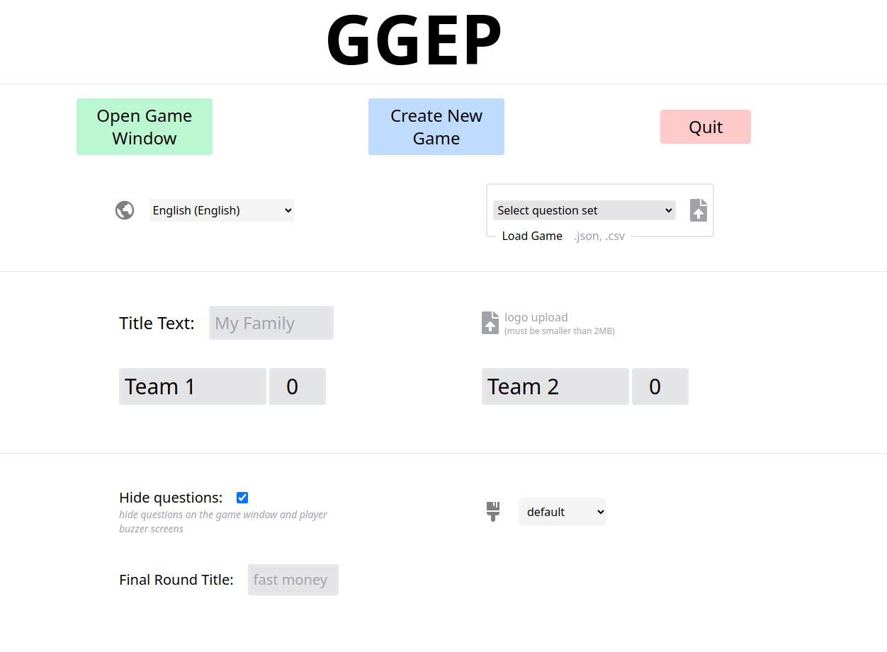

# Cold Family Feud
I was unsatisfied with the family feud projects
I found on github and I didn't want to use powerpoint(I use linux 🐧)

I so I decided to make it from scratch and make it as functional as possible.

Features:
- Game creator and loader. Look in `games/` folder for already created games
  load games in either `/new` or `/admin`
- seperated admin console from game window
- Buzzer functionality that accounts for latency with registered players. `/buzzer`
- functional fast money round with appropriate controls
- Changable title screen text
- family feud sounds at triggered events
  (sounds are subject to copyright and will be changed later)
- timers for fast money 1 and 2
- game window screen can go back in history
- Changeable team names
- Hostable/Joinable Rooms with generated room codes
- Localization support
  - English
  - Español 

## Start

In project root

```
npm run build
npm run start
```
go to

http://localhost:3000/game  
(Click on the browser window to allow sounds... not sure why this is a requirement in chrome)

http://localhost:3000/admin

Put /game on the projector/screen share. 

you'll want to screen share using an application that shares your audio 

Have your players go to http://[IP_ADDRESS]:3000/buzzer to register for the game

### Update via Git

```sh
git checkout master
git pull
npm install
npm run build
npm start
```
if you have trouble do `rm -r node_modules` then retry `npm install`

### Screen Share Audio Linux

it is kinda hard on linux to get an application that will share your audio so here is a quick hack
with pulse audio to pipe your computer's sound through your microphone.

```sh
pactl load-module module-null-sink sink_name=MySink
pactl load-module module-loopback sink=MySink

In pulse audio choose outputs in the recording tab

```

This will give you multiple recording sinks where you can attach one to your microphone and 
one your the monitor of your desktop or headset. Resulting in output audio getting piped to your application


## Screenshots





## Contributing

Stack: Nextjs + React + Tail Wind css

### Add Language
Check out this link in the wiki: [Link](https://github.com/joshzcold/Cold-Family-Feud/wiki/Add-A-New-Language)

### New Games

Go to `/new` to use the new game creator

Games are loaded in the admin console

If you make a new game make a pull request
and we can add it to the default games in `/games` 😀

Add your game to the language folder you created your game in

For Example Español `games/es/my_spanish_game.json`

For default games I would prefer that they follow a theme. 
Like a holiday or topic like tech or media

